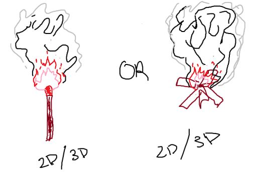

By: Harvey Tsang

***Introduction***
---
For the final project I chose to do option 4, which was to implement a technique that was discussed in class and something I didn’t already implement. I settled on an Eulerian smoke simulation with the aim of extending it to fire. We talked about Eulerian fluid in class, so there is a direct relation to my project topic. Eulerian fluid follows changes in flow over a single location in space and utilizes the Navier-Stokes equation to help calculate the flow of incompressible fluid (smoke and fire in my case). The state-of-the-art way to implement fire and smoke as fluid often includes volumetric fluid solvers, often using some form of the Navier-Stokes equation and treating the simulation space as a flow-grid. An example used by lots of research in fire-safety is the Fire Dynamics Simulator (FDS), which uses a Large eddy simulation for turbulance using the Navier-Stokes equation, and a Smokeview (SMV) program used to display the fire and smoke. As seen in <a href="https://www.sciencedirect.com/science/article/abs/pii/S0379711223001467"> Real-time visualization of smoke for fire safety engineering applications </a>  AND in <a href="https://history.siggraph.org/wp-content/uploads/2023/01/2004-Poster-101-Barrero_CFD-and-Realistic-Visualization-for-the-Analysis-of-Fire-Scenarios.pdf"> Computation and Representation of Fire and Smoke in Buildings </a>. Here is the direct source for <a href="https://pages.nist.gov/fds-smv/"> FDS-SMV </a>. Another flow-grid solver example, <a href="https://dl.acm.org/doi/pdf/10.1145/3388767.3407380"> Sparse Smoke Simulations in Houdini </a> , implements smoke using a more efficient and sparse fluid solver that skips inactive spaces, where the traditional volumetric fluid solver does not. However, their approach still derives from solving the Navier-Stokes equations.

***My approach and key algorithms***
---
In my implementation, I follow the code examples as provided from Jos Stam's <a href="http://graphics.cs.cmu.edu/nsp/course/15-464/Fall09/papers/StamFluidforGames.pdf"> Real-Time Fluid Dynamics for Games </a>, which uses a simplified version of the Navier-Stokes equations to create a more stable simulation as seen here: 

   .

This approach involves advection and diffusion of the fluid's density, as well as advection, diffusion, and projection of the velocity. These density and velocity components are represented within a grid covering the whole simulation space. Calculating the diffusion of a component involves using the Gauss-Seidel solver which essentially finds the component that when diffused backwards will yield the current value. This approach is relatively simple and also stable. For the advection, a simple linear backtrace is used, where the velocity is traced backwards and the value at the grid-cell it lands in will be used. Using a backtrace approach allows for better stability than a forward approach. Finally, for the velocity, projection is used to ensure best stability, mass conservation, and fluid incompressability. For visualization, I simply took the value of each point in the grid and used it to color its corresponding pixel in the scene.

Because this implementation utilizes a grid to model the flow of velocity and density, the computation scales up with the size of the scene. There are nested loops iterating across the rows and columns of the grid for advection, diffuse, projection, and other steps for initialization and scene visualization. This makes computation time atleast O(N^2). Due to this fact, I had to restrict my scene to a small window for it to run smoothly in real-time. This bottleneck may be avoided if you were to do an offline simulation or use a different language. I implemented the simulation in processing(java based language) for easier visualization and consistency with my other projects, which isn't the best for real-time physics simulations, where as the author's originally wrote their version in C.

For the fire simulation, I based my implementation off of Professor Guy's fire code. On top of the same diffuse and advect functions that we saw with the smoke, added components of oxygen and fuel combine in a "burn" equation that produces heat. which combine to produce heat. We use the heat grid then to visualize the fire, where higher heat density means hotter fire. There is also a convective velocity for higher heat densities to simulate heat rising. 

***Project sketch overview***
---
|Initial Sketch          | Updated Sketch         | 
|-------------------------|-------------------------|
 |  | 

For the most part, my goal remained the same throughout the implementation process, and I was able to achieve some reasonable looking results (see below images). 

|Initial Smoke implementation | Updated Smoke Implemetation         | 
|-------------------------|-------------------------|
 |  |  

With the detailed breakdown of fluid simulation from Jos Stam's paper, getting the smoke simulation working was pretty straight-forward. The biggest challenge here was getting realistic behaviour, which I was able to achieve after tweaking the diffusion and viscosity constants for the smoke. Between the first and second image I also applied a dissipation factor to the smoke since it wasn't fading over time and became overly-concentrated very rapidly. Overall, I was very happy with my results.

|Final Fire startup | Final Fire mid-sim |
|-------------------------|-------------------------|
 |  |     

Once I figured out the smoke, transitioning from smoke to fire was relatively easy since the foundation for the fluid-simulation was already set. Initially I thought that I might have to simulate both smoke and fire and combine them somehow, since their behaviour is a bit different. However, having convectivity based on the heat value allows for separate looking behaviours between concentrated heat and dispersing heat. By coloring the heat based on it's density, smoke can be simulated at lower heat values. This gives a pretty nice look of smoke rising from the top of the flames.

***Peer Feedback***
---

I received feedback on my smoke simulation saying that it might benefit from adding user interaction, obstacles, or a more compled environment/background. My smoke simulation itself was pretty well accepted by my peers for its realistic visuals. I was origianlly planning on adding some sort of scene, as depicted in my original project sketch, and I was able to make it look somewhat like a campfire in the end. I also added some basic interaction such as starting and stopping the fire simulation, as well as gusts of wind that can be triggered by the user. I didn't get to adding obstacles beyond the boundaries of the scene.

***Possible Extensions and Limitations**
---

As one of my peers suggested, I think adding more complex obstacles would be an interesting extension. I might try to add obstacles using the same boundary mechanics that were used for the edges of the scene. Another extension would to make the fire/smoke a part of a larger, more active scene. Currently my firecamp scene is pretty basic and shows off the simulation itself pretty well, but that is about it.

  Another thing I might try in the future is to get a better color gradient for the fire and smoke. I implemented the color so that the heat was colored based on certain threshold values. This makes for some pretty distinct lines in the color distribution, which looks somewhat animated and unnatural.

The main limitation I had was slow real-time simulation with larger scenes. The larger my scene was the choppier the simulation would be, which wasn't ideal for the realistic real-time simulation I was aiming for. This might work better in a different language or as an offline simulation instead. 

  Since the approach I took for visualization was essentially to iterate through and color every scene pixel based on the grid values, every single pixel is redrawn when the scene is updated. This leaves it so that other objects I want to draw must be draw ontop of the fire simulation otherwise they would be drawn over. Textured backgrounds are not an option because of this as well; it would simply get covered up. I might try and fix this by trying to avoid redrawing certain areas with no smoke/fire, which would allow for more customization with the background and may also increase simulation speed since less areas would have to be redrawn at every update.

